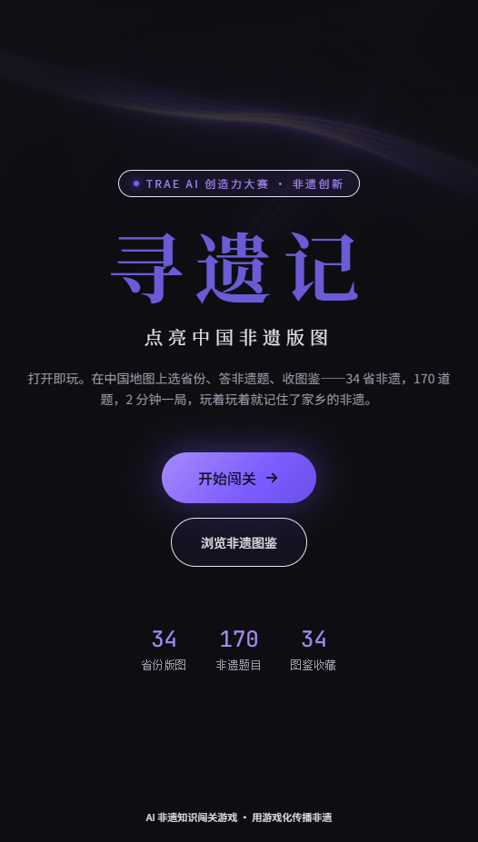
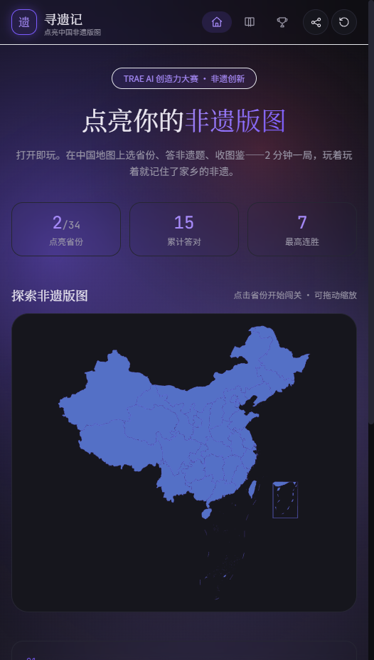
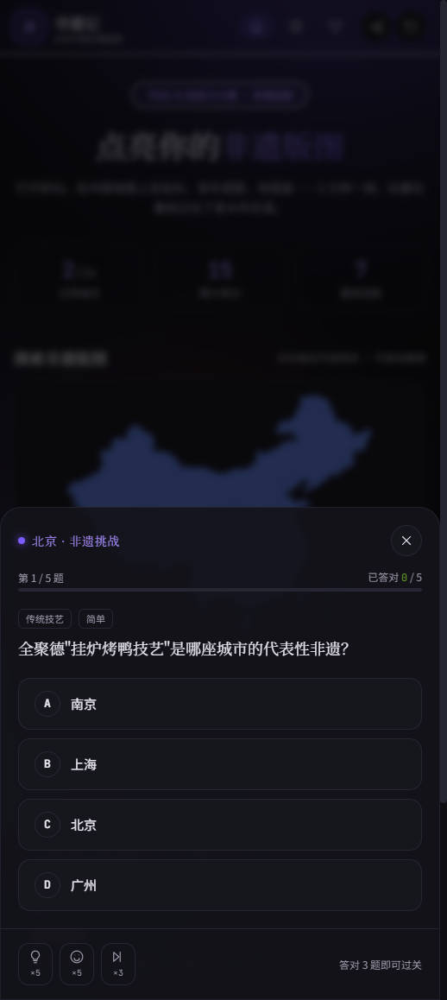
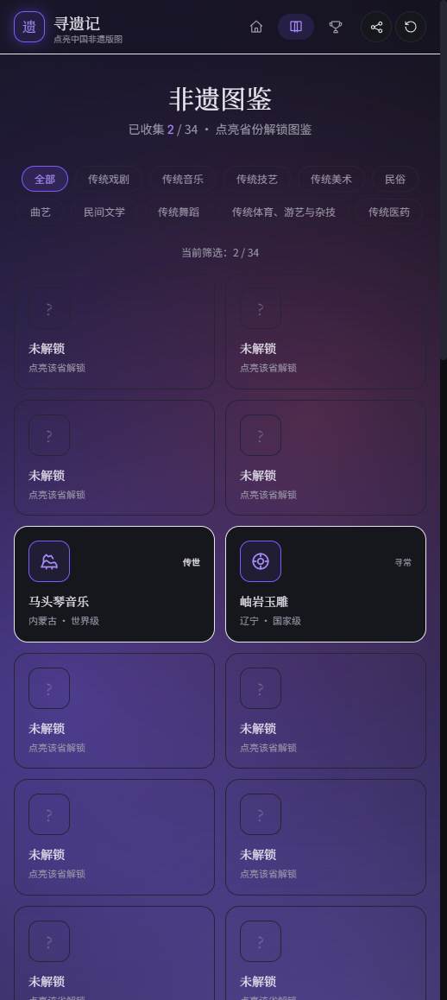
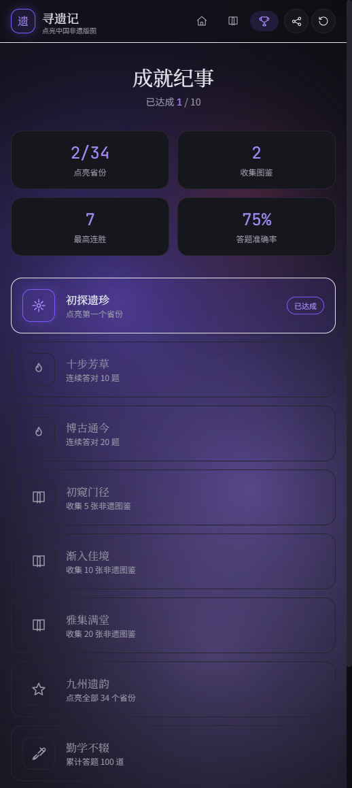

# 寻遗记 · 点亮中国非遗版图

> **TRAE AI 创造力大赛 · 非遗创新赛道参赛作品**

「寻遗记」是一款**打开即玩、零安装、零注册**的 AI 非遗知识闯关 Web 游戏。在中国地图上选择省份、答题闯关、收集非遗图鉴——2 分钟一局的轻量游戏，玩着玩着就记住了家乡与全国的非遗知识。

---

## 🎯 项目价值与社会意义

### 解决的痛点

| 痛点 | 现状 | 我们的解法 |
|------|------|-----------|
| **知识获取门槛高** | 非遗知识分散在学术论文、博物馆、纪录片中，普通人难以触及 | 游戏化拆解，每道题都是一次非遗记忆锚点 |
| **传播效率低下** | 传统非遗传播依赖线下活动、媒体报道，触达范围有限 | Web 链接即传播，零运营成本覆盖全国 |
| **地域认知局限** | 人们往往只了解家乡非遗，对其他省份知之甚少 | 中国地图可视化，点击即探索，打破地域壁垒 |
| **学习体验枯燥** | 百科式知识罗列，缺乏互动与反馈 | 闯关机制、道具系统、图鉴收集，持续激励 |

### 目标用户

- **普通大众**：对中国传统文化感兴趣但缺乏系统了解渠道的人群
- **青少年**：寓教于乐的非遗知识学习工具
- **非遗爱好者**：系统化收集和了解全国非遗的趣味方式
- **文化传播者**：一键分享战绩，带动身边人参与

### 实际作用

游戏化降低非遗知识门槛——从"需要专门去学"变成"随手可玩的趣味挑战"。每一道题都是一次非遗记忆的锚点，每点亮一个省份都是一次文化认同的强化。

---

## ✨ 核心功能

### 1. 宣传落地页

全屏沉浸式宣传首页，紫调 FloatingLines 着色器背景配合 ShinyText 闪光标题，打造现代东方美学视觉体验。



### 2. 地图闯关

基于 ECharts 的中国地图（含港澳台），点击省份即可开始闯关。已点亮省份以紫调光晕高亮，进度一目了然。



### 3. 答题系统

每个省份 5 道非遗题，涵盖十大非遗类别（传统戏剧、传统音乐、传统技艺、传统美术、民俗、曲艺、民间文学、传统舞蹈、传统体育游艺与杂技、传统医药）。答对 3 题即可过关，答错不惩罚。



### 4. 道具系统

四种道具助力闯关，降低挫败感：
- **提示卡**：暗化一个错误选项
- **五五开**：随机去掉两个错误选项
- **跳过卡**：跳过当前题目
- **复活卡**：答错后可重答一次

### 5. 非遗图鉴

点亮省份解锁对应非遗图鉴，支持按类别筛选，查看详细介绍。未解锁图鉴灰显锁定，激发收集欲。



### 6. 成就系统

10 项成就记录玩家的非遗探索之旅：首次过关、连续答对、全图点亮、零失误通关等。



### 7. 进度持久化

所有数据（点亮省份、图鉴、道具、成就、答题统计）自动保存至 localStorage，刷新不丢失，零服务器成本。

### 8. 一键分享

生成战绩分享文案，支持 Web Share API，一键分享到社交平台。

---

## 🎨 设计风格

现代东方美学：墨黑 `#0E0E12` + 宣纸白 `#F5F2EA` 为底，紫调 `#7C5CFF` 光效为魂，朱砂 `#C73E3A` 仅用于关键节点的克制点缀。视觉灵感取自水墨晕染、印章纹样、卷轴展开与镂空窗格。

动效组件均采用 **reactbits.dev** 官方源码：
- **FloatingLines**（three.js WebGL 着色器背景）
- **ShinyText**（流光扫光文字动效）

详见 [DESIGN-GUIDE.md](DESIGN-GUIDE.md)。

---

## 🛠️ 技术栈

| 层 | 技术 | 说明 |
|----|------|------|
| 框架 | React 18 + TypeScript | 类型安全的前端开发 |
| 构建 | Vite 5 | 极速开发与构建 |
| 样式 | Tailwind CSS + CSS Variables | 深色/浅色主题切换支持 |
| 地图 | ECharts + 阿里云 DataV GeoJSON | 中国地图（含港澳台） |
| 动效 | Framer Motion + reactbits | 流畅的动画与视觉效果 |
| 状态 | Zustand + localStorage | 轻量状态管理与持久化 |
| 路由 | React Router DOM | SPA 路由 |

### 题库生成策略

题库采用**离线批量生成**策略：由大模型经 TRAE 生成 170 道题目（34 省 × 5 题），覆盖十大非遗类别，难度分布为 2 easy + 2 normal + 1 hard，人工抽样校验后打包为静态资源，运行时随机抽题，零延迟、零调用成本。

---

## 🚀 快速开始

### 在线体验

项目已部署至 Vercel：**https://xunyiji.vercel.app**

### 本地运行

```bash
# 克隆仓库
git clone https://github.com/CGz4526/TRAE_FindHeritage.git
cd TRAE_FindHeritage

# 安装依赖
npm install

# 启动开发服务器
npm run dev

# 构建生产产物
npm run build

# 预览构建产物
npm run preview
```

开发服务器默认运行在 `http://localhost:5173`。

---

## 📁 项目结构

```
src/
├── components/           # UI 组件
│   ├── FloatingLines.tsx   # reactbits 着色器背景（three.js）
│   ├── ShinyText.tsx       # reactbits 闪光文字动效
│   ├── MapView.tsx         # ECharts 中国地图
│   ├── QuizModal.tsx       # 答题闯关弹窗
│   ├── AuroraBackground.tsx # Canvas 极光背景
│   ├── Onboarding.tsx      # 新手引导浮层
│   └── Icons.tsx           # 自定义镂空线性图标库
├── pages/               # 页面组件
│   ├── LandingPage.tsx     # 宣传落地页
│   ├── CollectionPage.tsx  # 非遗图鉴收集
│   └── AchievementsPage.tsx # 成就系统
├── data/                # 静态数据
│   ├── questions.ts        # 170 道非遗题库
│   ├── heritages.ts        # 34 省非遗图鉴数据
│   ├── provinces.ts        # 省份元数据与 GeoJSON 映射
│   └── achievements.ts     # 成就定义
├── store/               # Zustand 状态管理
│   └── gameStore.ts        # 游戏状态与本地存档
├── types/               # TypeScript 类型定义
│   └── index.ts            # 核心数据模型
├── App.tsx              # 主应用路由
├── index.css            # 设计令牌与全局样式
└── main.tsx             # 入口文件
```

---

## 📖 相关文档

- [项目计划书.md](项目计划书.md) — 完整的产品规划、技术架构与开发里程碑
- [DESIGN-GUIDE.md](DESIGN-GUIDE.md) — 设计系统与视觉规范，含 uipro-cli 与 reactbits 使用指南

---

## 📄 许可

本项目为 TRAE AI 创造力大赛参赛作品，仅供学习交流使用。

---

## 📬 联系方式

- 仓库地址：https://github.com/CGz4526/TRAE_FindHeritage
- 参赛赛道：非遗创新创意开发赛道
